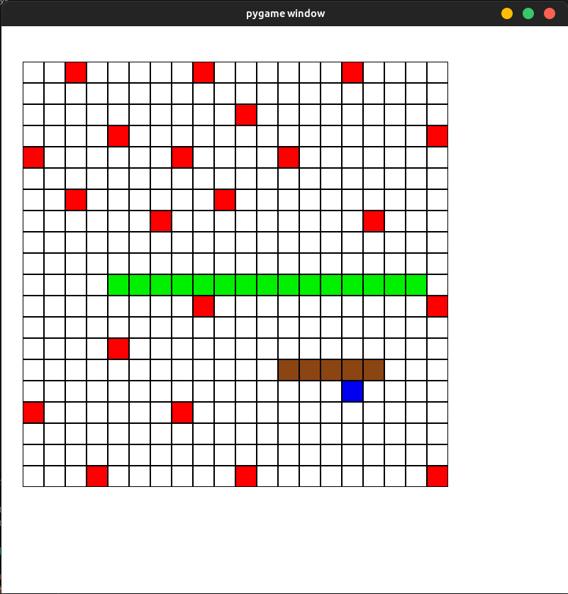

# Multiplayer Snake Game

This is a multiplayer Snake game implemented in Python using the Pygame library. Players control snakes on a grid, trying to eat food to grow while avoiding collisions with the walls and other snakes. The game supports local multiplayer, allowing two players to compete against each other.

## Features

- Multiplayer mode for two players.
- Simple and intuitive controls using arrow keys.
- Snakes grow longer when they eat food.
- The game ends when a snake collides with a wall or itself.
- Keeps track of each player's score.
- Colorful graphics and smooth animations.

## Getting Started

### Prerequisites

- Python 3.x
- Pygame library